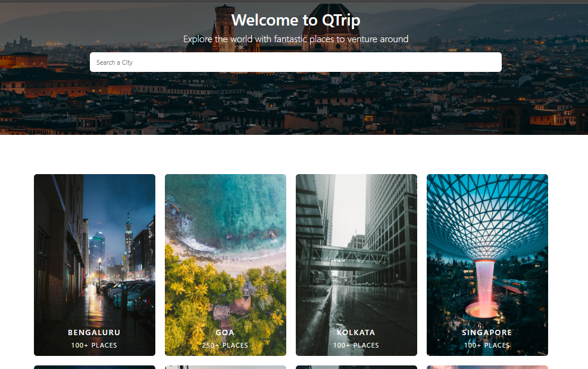

# Travel-Website-Dynamic

This is a travel website aimed at travellers looking for a multitude of adventures in different cities.

https://frontend-teal-six-77.vercel.app/

Throughout the development of this project:

1. Constructed web pages through the integration of HTML and CSS, imbuing them with dynamism through the incorporation of JavaScript.
2. Elevated user experience by introducing multi-select filters and engaging image carousels.
3. Executed conditional rendering of page elements, tailoring the content based on user interactions and preferences.
4. Implemented localStorage to seamlessly persist user choices on the client-side, ensuring a personalized and convenient browsing experience.
5. Employed JQuery to streamline the reservation form submission process, enhancing the efficiency of user interactions.
6. Successfully deployed the website on both Netlify and Heroku, making it accessible to a broader audience.

